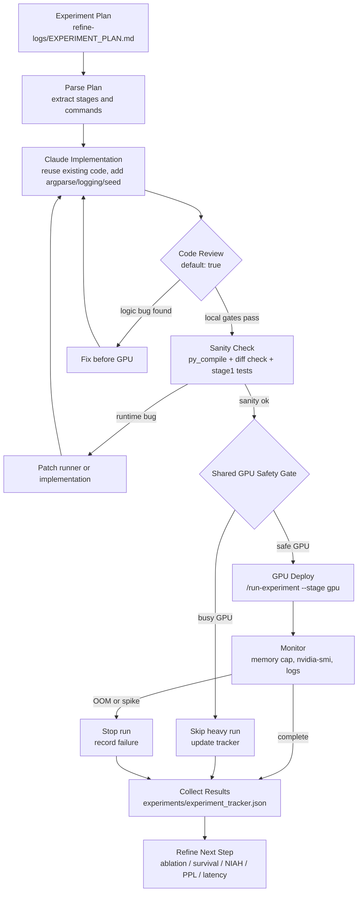

# Workflow 1.5

## Purpose

Workflow 1.5 turns `refine-logs/EXPERIMENT_PLAN.md` into a safety-gated experiment run:

```text
Experiment plan -> Claude implementation -> GPT-5.4/GPT-5.5 code review -> sanity check -> GPU deploy -> monitor -> results
```

## Flowchart



## Commands

Parse the plan:

```bash
./run-experiment --stage parse-plan
```

Run default sanity workflow:

```bash
./run-experiment --stage sanity --gpu-index 1
```

Run stage-2 smoke if GPU safety allows:

```bash
CUDA_VISIBLE_DEVICES=1 ./run-experiment --stage stage2 --gpu-index 1
```

GPU deploy entry point:

```bash
CUDA_VISIBLE_DEVICES=1 ./run-experiment --stage gpu --suite stage2 --gpu-index 1
```

Run with the 30 GiB safety fuse requested for implementation debugging:

```bash
CUDA_VISIBLE_DEVICES=1 ./run-experiment --stage gpu --suite stage2 --gpu-index 1 --allow-busy --max-vram-gib 30 --monitor-interval-sec 5
```

If the child experiment process exceeds `--max-vram-gib`, the orchestrator kills
the process group, records `monitor_killed_by_monitor: true`, and treats the run
as an implementation failure to fix before continuing.

This fuse is a polling guard, not a hardware memory limit.  The hard budget is
still the PyTorch cap (`--cap-gib`, default 22 GiB).  Monitor events include
`kill_kind: vram | timeout | monitor_error` so timeout and VRAM overflow are not
confused in the tracker.

Current executable suite:

- `stage2`: real-model short-context smoke, safety-gated.
- `niah`: real-model Needle-in-a-Haystack smoke, safety-gated.
- `ablation`: Stage2 quality ablation comparing full KV, short KV without retrieval, and dot-product retrieval.

Suites that still require dedicated runners before activation:

- `survival`
- `ppl`
- `latency`

The orchestrator intentionally returns `status: failed` for those suites until their
own audited scripts exist, so `/run-experiment` cannot accidentally launch an
unreviewed 128K job.

Run the first NIAH smoke:

```bash
CUDA_VISIBLE_DEVICES=1 ./run-experiment --stage gpu --suite niah --gpu-index 1 --cap-gib 22 --max-vram-gib 30 --niah-lengths 4096 8192 --niah-depths 0.25 0.5 0.75 0.9 --niah-trials 1
```

Run the Workflow 2.0 Stage2 quality ablation:

```bash
CUDA_VISIBLE_DEVICES=1 ./run-experiment --stage gpu --suite ablation --gpu-index 1 --cap-gib 22 --max-vram-gib 30 --ablation-lengths 4096 8192
```

## Review Rule

`--code-review` is enabled by default. It currently runs deterministic local gates:

- Python syntax compilation.
- `git diff --check`.
- forbidden-pattern checks for known failed ideas.

External GPT-5.4/GPT-5.5 review should inspect the tracker entry before expensive GPU runs. If that review finds a bug, record it in the tracker and return to implementation before deployment.

The first GPT-5.5 review for this workflow found and fixed these safety issues:

- target-GPU compute apps are now a hard skip condition, even when memory/utilization look low.
- direct child-script GPU use now requires `CUDA_VISIBLE_DEVICES` to map `cuda:0` to the safety-checked physical GPU.
- sanity treats only explicit shared-server skips as acceptable; other safety-gate errors fail.
- skipped GPU runs are recorded as `status: skipped`, distinct from real failures.
- `--tracker` now derives the paired JSONL path unless `--tracker-jsonl` is provided.
- stage-2 smoke receives the orchestrator seed.

## Tracker

All workflow stages update:

```text
experiments/experiment_tracker.json
experiments/experiment_tracker.jsonl
```

Custom tracker paths may be supplied:

```bash
./run-experiment --stage sanity --tracker experiments/custom_run.json
./run-experiment --stage sanity --tracker experiments/custom_run.json --tracker-jsonl experiments/custom_run.events.jsonl
```

The tracker records:

- plan parse summary
- code review status
- sanity status
- GPU safety status
- command tails
- pass/fail/skip reason
